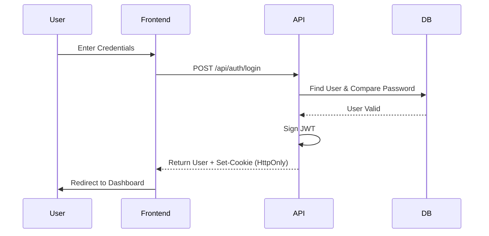
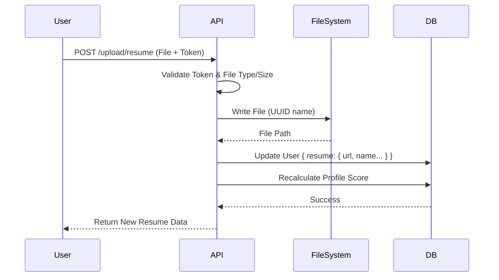

# JobSync - Comprehensive Project Documentation

## 1. Project Overview

**JobSync** is a modern, responsive job portal application designed to connect job seekers with employers, specifically tailored for the Australian market. The application is built using **Next.js 15** (App Router) and features a hybrid architecture that combines a fully functional authentication and user profile system with a demonstrative frontend for job listings and company profiles.

The platform provides a seamless user experience with a high-quality UI built on **Tailwind CSS** and **Radix UI** primitives. It includes a robust backend for user management, secure authentication, and file handling (resumes and profile images), while currently simulating job market data to demonstrate the platform's capabilities.

### Key Highlights
-   **Modern Tech Stack:** Built on the latest Next.js 15 framework with TypeScript.
-   **Secure Authentication:** Custom JWT-based authentication with HttpOnly cookies.
-   **User Profile System:** comprehensive profile management with completion tracking.
-   **File Handling:** Secure upload and management of resumes and profile pictures.
-   **Responsive Design:** Mobile-first approach using Tailwind CSS v4.
-   **Interactive UI:** Rich animations using Framer Motion and accessible components via Radix UI.

---

## 2. Full Feature Breakdown

### 2.1 Public Interface
The public-facing side of the application is designed to attract users and showcase opportunities.

*   **Landing Page (`/`)**:
    *   **Hero Section:** Dynamic gradient backgrounds with a search bar for jobs.
    *   **Featured Categories:** Grid layout showcasing job categories (e.g., Construction, Electrical, Culinary) with Australian context.
    *   **Recent Jobs:** A preview of the latest job listings.
    *   **Testimonials & Stats:** Social proof sections.

*   **Job Listings (`/jobs`)**:
    *   **Search & Filter:** Users can filter jobs by keyword, category, location, and job type.
    *   **Job Cards:** Detailed cards showing salary, location, type, and posted date.
    *   **Mock Data:** Currently, job listings are served from a static dataset to demonstrate the UI/UX without a live database connection for jobs.

*   **Company Profiles (`/companies`)**:
    *   **Directory:** A list of top employers.
    *   **Company Details:** Mock pages showing company culture, open positions, and benefits.

*   **Informational Pages**:
    *   **About Us (`/about`)**: Timeline of the company's journey and mission.
    *   **Contact (`/contact`)**: Contact form and office details.

### 2.2 User System (Functional)
The user system is fully backed by a MongoDB database and API.

*   **Authentication**:
    *   **Sign Up (`/signup`)**: Registration with name, email, password, and role selection (User/Admin).
    *   **Sign In (`/signin`)**: Secure login returning a JWT.
    *   **Logout**: Securely clears the authentication cookie.

*   **User Dashboard (`/user`)**:
    *   **Profile Management**: Users can update their personal details (Bio, Phone, Location, Skills).
    *   **Resume Upload**: Dedicated interface to upload, view, and delete resumes (PDF/DOCX).
    *   **Profile Picture**: Upload and update profile avatars.
    *   **Profile Completion**: A dynamic progress bar that encourages users to complete their profile (e.g., "80% Complete").

### 2.3 Admin Dashboard (UI/Mock)
The admin panel (`/admin`) provides a visual interface for platform management.

*   **Overview**: Analytics charts (using Recharts) showing user growth and job stats.
*   **Job Management**: UI for creating, editing, and deleting jobs (currently operates on local state/mock data).
*   **User Management**: Table view of registered users.
*   **Settings**: Configuration options for the platform.

---

## 3. Technical Architecture

The project follows a **Monolithic Architecture** using the Next.js App Router, where the frontend and backend coexist in the same repository.

### 3.1 Frontend Architecture
-   **Framework:** Next.js 15 (React 19).
-   **Rendering:** Server-Side Rendering (SSR) for initial load and SEO, combined with Client-Side Rendering (CSR) for interactive components.
-   **Styling:** Utility-first CSS with **Tailwind CSS v4**.
-   **Component Library:** **Radix UI** (headless) wrapped with **Shadcn UI** patterns for accessibility and customization.
-   **State Management:** React `useState` and `Context` for local state; URL search params for filter state.

### 3.2 Backend Architecture
-   **API Routes:** Next.js Route Handlers (`src/app/api/...`) serve as the backend REST API.
-   **Database:** **MongoDB** accessed via **Mongoose** ODM.
-   **Authentication:** Custom implementation using **JSON Web Tokens (JWT)**.
-   **File Storage:** Local filesystem storage (`public/uploads`) for simplicity, serving files directly via the Next.js static file server.

### 3.3 Directory Structure
```
src/
├── app/                 # Next.js App Router pages and API routes
│   ├── api/             # Backend endpoints (auth, upload)
│   ├── (public)/        # Public pages (jobs, about, etc.)
│   ├── admin/           # Admin dashboard pages
│   └── user/            # User dashboard pages
├── components/          # Reusable UI components
│   ├── ui/              # Radix/Shadcn primitives
│   └── ...              # Feature-specific components
├── lib/                 # Utilities (DB connection, helpers)
├── models/              # Mongoose database schemas
└── ...
```

---

## 4. Technology Stack Explanation

| Category | Technology | Purpose |
| :--- | :--- | :--- |
| **Framework** | **Next.js 15.5** | Core framework for SSR, Routing, and API. |
| **Language** | **TypeScript** | Static typing for code reliability and maintainability. |
| **Database** | **MongoDB** | NoSQL database for storing user data. |
| **ODM** | **Mongoose** | Schema-based modeling for MongoDB. |
| **Styling** | **Tailwind CSS v4** | Rapid UI development with utility classes. |
| **UI Primitives** | **Radix UI** | Accessible, unstyled UI components (Dialog, Popover, etc.). |
| **Icons** | **Lucide React** | Consistent, lightweight SVG icons. |
| **Animation** | **Framer Motion** | Complex animations and layout transitions. |
| **Forms** | **React Hook Form** | Performant form validation and state management. |
| **Validation** | **Zod** | Schema validation for forms and API inputs. |
| **Auth** | **JWT + Bcrypt** | Stateless authentication and password hashing. |
| **File Handling** | **Node.js FS** | Native file system operations for uploads. |

---

## 5. API and Backend Summary

The backend is exposed via Next.js Route Handlers. Currently, the API focuses on Authentication and User Management.

### 5.1 Authentication Endpoints
*   `POST /api/auth/register`: Creates a new user document. Validates uniqueness of email.
*   `POST /api/auth/login`: Authenticates credentials. Returns user info and sets a `token` cookie (HttpOnly).
*   `POST /api/auth/logout`: Clears the authentication cookie.

### 5.2 User & Profile Endpoints
*   `GET /api/auth/profile`: Fetches the currently logged-in user's profile data.
*   `PUT /api/auth/profile`: Updates user details (Bio, Skills, Location, etc.).

### 5.3 File Upload Endpoints
*   `POST /api/auth/upload/resume`: Accepts a file (PDF/DOC), saves it to disk, and updates the user's `resume` field in DB.
*   `DELETE /api/auth/upload/resume`: Removes the resume file and clears the DB field.
*   `POST /api/auth/upload/profile-image`: Handles avatar uploads.

### 5.4 Mocked Data
*   **Jobs & Companies:** There are **NO** API endpoints for creating or fetching jobs/companies from the database. These are currently hardcoded in the frontend files (`src/app/jobs/page.tsx`, etc.).

---

## 6. Authentication Explanation

The application uses a **Custom JWT Implementation** rather than a library like NextAuth.js (though NextAuth is installed, it is not the primary active auth mechanism).

### The Flow:
1.  **Login:** User submits credentials.
2.  **Verification:** Server finds user in MongoDB and uses `bcrypt.compare()` to validate the password.
3.  **Token Generation:** A JWT is signed containing `userId`, `email`, and `role`.
4.  **Cookie Setting:** The token is sent back in a `Set-Cookie` header.
    *   `httpOnly: true` (Prevents XSS access)
    *   `secure: true` (HTTPS only in production)
    *   `sameSite: 'strict'` (CSRF protection)
    *   `maxAge`: 7 days.
5.  **Middleware:** Next.js Middleware (if configured) or per-route logic checks this cookie to protect private routes (`/user`, `/admin`).

---

## 7. Database Structure

The database is **MongoDB**. Currently, there is one primary collection: **Users**.

### User Schema (`src/models/User.ts`)
The `User` model is comprehensive and stores all user-related data.

| Field | Type | Description |
| :--- | :--- | :--- |
| `name` | String | Full name of the user. |
| `email` | String | Unique email address (indexed). |
| `password` | String | Bcrypt hashed password. |
| `role` | String | 'user' or 'admin'. Default: 'user'. |
| `profileCompletion` | Number | Calculated score (0-100) based on filled fields. |
| `resume` | Object | Sub-document containing file details (see below). |
| `skills` | Array | List of strings representing user skills. |
| `bio`, `location`, `phone` | String | Profile details. |

### Resume Sub-Schema
Stored directly within the User document (embedded):
```typescript
{
  filename: String,
  fileUrl: String,   // Path to file in /public/uploads
  fileSize: Number,
  fileType: String,
  uploadedAt: Date
}
```

---

## 8. CV Upload or File Upload Workflow

The file upload system is built from scratch using Next.js API routes and Node.js filesystem (`fs/promises`).

### Step-by-Step Workflow:
1.  **User Action:** User selects a file (PDF/DOCX) in the Profile UI.
2.  **Frontend Request:** A `FormData` object is created, and a `POST` request is sent to `/api/auth/upload/resume` with the Bearer token.
3.  **API Validation:**
    *   **Auth Check:** Verifies the JWT token.
    *   **File Check:** Validates file existence, type (must be PDF/Word), and size (max 5MB).
4.  **File Processing:**
    *   A unique filename is generated using `uuid`.
    *   The file is written to `public/uploads/resumes/` on the server disk.
5.  **Cleanup:** If a previous resume existed, the system attempts to delete the old file to save space.
6.  **Database Update:** The `User` document is updated with the new file metadata.
7.  **Gamification:** The `profileCompletion` score is recalculated and updated (e.g., +20 points for adding a resume).
8.  **Response:** The server returns the new resume URL, which the frontend displays immediately.

---

## 9. Profile System Flow

The profile system is designed to be interactive and encourage completion.

1.  **Initialization:** When a user logs in, their profile data is fetched.
2.  **Visualization:** A "Profile Completion" progress bar is displayed.
3.  **Editing:** Users can edit fields via a modal or form.
4.  **Calculation Logic:**
    *   The backend (`User.ts`) has a static method `updateProfileCompletion`.
    *   It assigns points: Name (15), Email (15), Phone (10), Location (10), Bio (10), Skills (10), Image (15), Resume (15).
    *   Whenever a user updates their profile or uploads a file, this method runs to update the score.
5.  **Persistence:** The score is saved to the database, allowing for features like "Search for users with complete profiles" in the future.

---

## 10. Security Considerations

The application implements several security best practices:

*   **Password Hashing:** Passwords are never stored in plain text. `bcryptjs` is used with a salt round of 12.
*   **HttpOnly Cookies:** JWTs are stored in HttpOnly cookies, making them inaccessible to client-side JavaScript, effectively mitigating XSS attacks.
*   **Input Validation:** `Zod` and Mongoose schemas ensure that data sent to the API is valid and sanitized.
*   **File Upload Security:**
    *   **Type Validation:** Strict allowlist for MIME types.
    *   **Size Limits:** Prevents DoS attacks via large files.
    *   **Renaming:** Files are renamed with UUIDs to prevent directory traversal attacks or overwriting.
*   **Environment Variables:** Sensitive keys (MongoDB URI, JWT Secret) are stored in `.env` and not committed to version control.

---

## 11. System Diagrams (Text-Based)

### 11.1 Authentication Flow


### 11.2 Resume Upload Flow


---

## 12. Conclusion and Future Scope

**JobSync** is a solid foundation for a recruitment platform. It successfully implements the "hard parts" of a web application: secure authentication, stateful user profiles, and file management. The UI is polished, responsive, and ready for production use.

### Current Limitations
*   **Mock Data:** Job listings and company data are currently static. They need to be moved to the database.
*   **Local Storage:** Storing uploads in `public/uploads` is not scalable for cloud deployments (e.g., Vercel).
*   **Admin Features:** The admin panel is largely visual and needs to be connected to real API endpoints.

### Future Scope & Recommendations
1.  **Database Expansion:** Create `Job` and `Company` schemas in MongoDB.
2.  **Cloud Storage:** Migrate file uploads to AWS S3 or Cloudinary for scalability.
3.  **Job Application Flow:** Implement the logic for a user to "Apply" to a job (linking User to Job).
4.  **Admin Functionality:** Connect the Admin Dashboard to the backend to allow real CRUD operations on Jobs and Users.
5.  **Search API:** Replace client-side filtering with a robust backend search API (using MongoDB Atlas Search).

This documentation covers the entire state of the JobSync application as of the current version.
